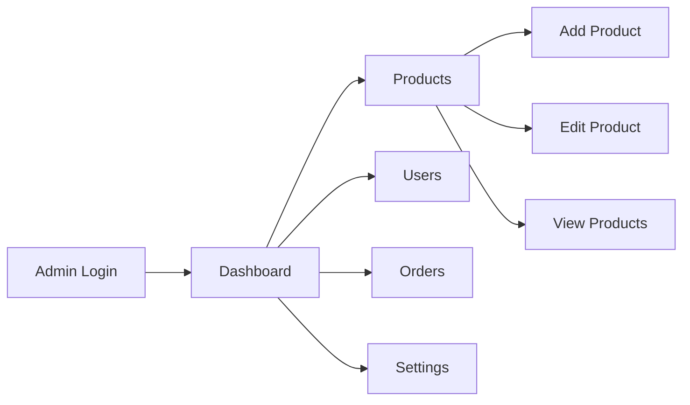
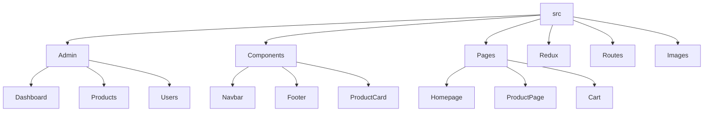
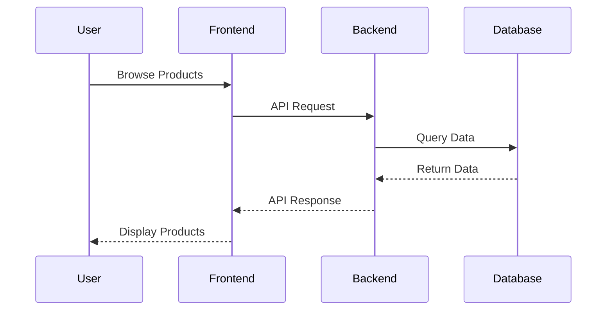

# 💎 Precious Charms - Your Gateway to Elegance

<div align="center">
  
  
  [](https://reactjs.org/)
  [](https://www.typescriptlang.org/)
  [](https://chakra-ui.com/)
  [](https://redux.js.org/)
</div>

## ✨ Overview

Welcome to Precious Charms, where elegance meets technology! Our platform redefines the jewelry shopping experience with a perfect blend of sophistication and modern e-commerce features. Whether you're looking for timeless pieces or contemporary designs, we've got you covered.

## 🚀 Key Features

### 👑 User Experience
| Feature | Description |
|---------|-------------|
| 🛍️ Smart Shopping | Intelligent product recommendations and personalized collections |
| 🔍 Advanced Search | Filter by category, brand, price, and more with real-time results |
| 🛒 Smart Cart | Dynamic cart management with instant updates and wishlist integration |
| 💳 Secure Checkout | Multiple payment options with industry-standard security |
| 📱 Responsive Design | Seamless experience across all devices |

### 👨‍💼 Admin Dashboard
| Feature | Description |
|---------|-------------|
| 📊 Analytics Hub | Real-time insights and performance metrics |
| 📦 Product Suite | Comprehensive product management with bulk operations |
| 👥 User Management | Advanced user analytics and management tools |
| 📊 Order Center | Streamlined order processing and tracking |
| ⚙️ System Control | Advanced settings and configuration options |

## 🛠️ Tech Stack

<div align="center">
  
  
  
  
</div>

### Frontend Architecture
- **React 18.2.0** - Modern UI framework
- **TypeScript 4.9.5** - Type-safe development
- **Redux Toolkit** - State management
- **Chakra UI** - Beautiful component library
- **Framer Motion** - Smooth animations
- **React Router v6** - Navigation system

### Backend Services
- **JSON Server** - Mock API server
- **Axios** - HTTP client
- **JWT** - Authentication

## 🚀 Quick Start

```bash
# Clone the repository
git clone https://github.com/yourusername/precious-charms.git
cd precious-charms

# Install dependencies
npm install

# Start development server
npm start

# Start JSON server (in new terminal)
npm run server
```

## 🔐 Admin Access

<div align="center">
  
</div>

### Admin Credentials
```yaml
email: admin123#gmail.com
password: admin123
```

### Admin Routes


## 📁 Project Structure



## 🎨 UI Components

<div align="center">
  
  
</div>

## 🔄 Data Flow


## Screenshots

## LANDING PAGE
[](https://postimg.cc/XpWKXJsm)

## PRODUCT PAGE
[](https://postimg.cc/r0FHWjy0)

## SINGLE PRODUCT PAGE
[](https://postimg.cc/k6BfCFQW)

## ADD TO CART PAGE
[](https://postimg.cc/7bznNLmP)

## ADMIN PRODUCT PAGE
[](https://postimg.cc/sMHWzFw0)

## USER DETAILS PAGE
[](https://postimg.cc/p5B913mC)

## 🤝 Contributing

We welcome contributions! Here's how you can help:

1. Fork the repository
2. Create your feature branch (`git checkout -b feature/AmazingFeature`)
3. Commit your changes (`git commit -m 'Add some AmazingFeature'`)
4. Push to the branch (`git push origin feature/AmazingFeature`)
5. Open a Pull Request

## 📄 License

This project is licensed under the MIT License - see the [LICENSE](LICENSE) file for details.

## 📞 Contact Us

<div align="center">
  <a href="mailto:support@preciouscharms.com">
    
  </a>
  <a href="https://www.preciouscharms.com">
    
  </a>
</div>

---

<div align="center">
  Made with ❤️ by the Precious Charms Team
  <br/>
  
</div>

